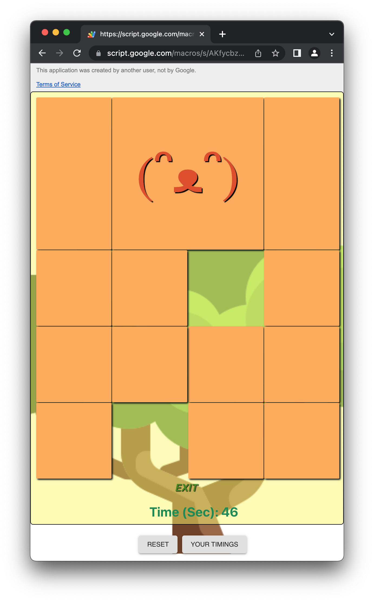

# React App Deployment on Google App Script 

This project creates a react version of Klotski game running on Google Web using Google Apps Script. 
The game interface includes a timer to track each game duration, and on game completion, 
the timing is written to a google spreadsheet, which can later be retrieved and displayed.

The project is adapted from a Klotski game written in react:
[Japanese Klotski Puzzle](https://github.com/ziqingW/Japan-klotski).

The icons in the projects are taken from [Flaticon](https://www.flaticon.com/search?word=bird).

A demo of the app hosted in Google App platfrom can be accessed via the link using Chrome  
https://script.google.com/macros/s/AKfycbzUWL_aoOlAzLI1M6o3pM4792CFu5jHcwc4zoz71YYS-fKmYzMFGBYXB-FT85T5vgmM/exec

## Project Dependencies
- [@types/google-apps-script](https://www.npmjs.com/package/@types/google-apps-script) - Type definitions for Google Apps Script.
- [@google/clasp](https://github.com/google/clasp) - Enable development using Google Apps Script locally.
- [Parcel](https://www.npmjs.com/package/parcel) - A zero configuration build tool for the web.
- [react](https://www.npmjs.com/package/react)  - A JavaScript library for creating user interfaces.
- [react-dom](https://www.npmjs.com/package/react-dom)  - A react renderer for the web.
- [gas-client](https://github.com/enuchi/gas-client) - A client-side wrapper class to call server-side Google Apps Script functions.

## References
- [Japanese Klotski Puzzle](https://github.com/ziqingW/Japan-klotski).
- [clasp tutorial](https://www.youtube.com/watch?v=aq2B02DuCs0&t=660s)
- [Google Apps Script for Google Sheets](https://developers.google.com/apps-script/guides/sheets)
- [Square Icon](https://www.flaticon.com/free-icon/square_5853902?term=square&related_id=5853902)
- [Tree Icon](https://www.flaticon.com/free-icon/tree_2220091?term=forest&related_id=2220091)
